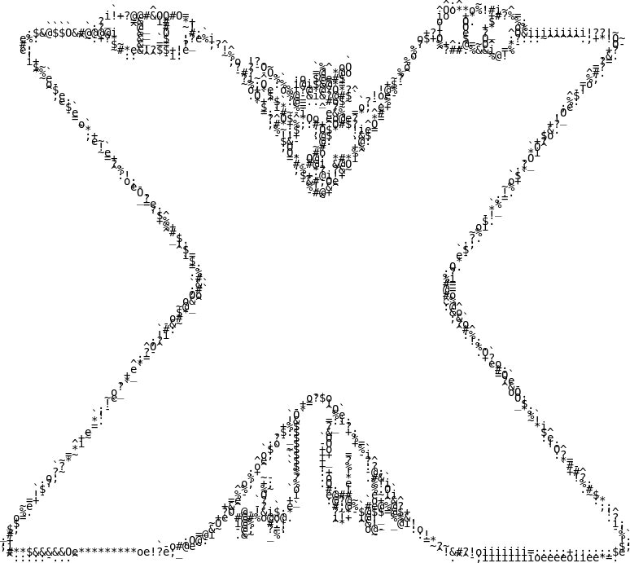

# InvesTool

[](https://github.com/axiaoxin-com/investool/)
[](http://golang.org)
[](https://github.com/axiaoxin-com/investool)
[](https://gitHub.com/axiaoxin-com/investool/releases/)
[](https://gitHub.com/axiaoxin-com/investool/releases/)

[](http://investool.axiaoxin.com?from=github)

<http://investool.axiaoxin.com?from=github>

InvesTool 项目是使用 Golang 实现的对股票进行基本面分析的程序，提供命令行和Web网页两种方式进行操作，同时支持对基金做筛选。数据来源于东方财富网、亿牛网、新浪财经、天天基金。

该程序不构成任何投资建议，仅作为个人对股票有限认知的辅助分析工具，不一定适用于任何人。

Web服务使用的是[pink-lady项目模板](https://github.com/axiaoxin-com/pink-lady)


# InvesTool 解决什么问题？

InvesTool 要解决的问题是，在使用东方财富选股器按设置的条件筛选出股票后，通常筛选出的股票数量较多，需要人工对每一支股票的财报指标进行分析以判断是否可以长期持有。

需要分析的指标较多，并且有一些指标无法直接获取，需要进行计算或根据历史财务数据进行计算，在大量股票需要分析的时候这是一个繁琐的工作，因此开发了 InvesTool 来让这个过程自动化。


# 功能

当前已实现的功能：

- 按指定条件的默认值自动筛选可以长期持有其股票的优质公司
- 按指定条件的自定义值自动筛选可以长期持有其股票的优质公司
- 实现股票检测器
- 支持 ROE、EPS、营收、利润、整体质地、估值、合理价、负债率、历史波动率、市值 检测
- 将筛选结果导出为 JSON 文件
- 将筛选结果导出为 CSV 文件
- 将筛选结果导出为 EXCEL 文件，并按行业、价格、历史波动率分工作表
- 将筛选结果导出为股票代码图片便于东方财富 APP 上导入到自选列表
- 支持关键词搜索股票并对其进行评估
- 检测器支持对银行股按不同规则进行检测
- 支持净利率和毛利率稳定性判断
- 增加获取东方财富智能诊股中综合评价和价值评估信息
- 支持 PEG 检测
- 支持营收本业比检测
- 支持财报审计意见检测
- 完善命令行使用方式，筛选参数和检测参数支持命令行自定义
- 支持负债流动比检测
- 支持现金流检测
- 提供 WEB 界面操作 <http://investool.axiaoxin.com?from=github>
- 支持基金 4433 筛选
- 自定义基金筛选
- 基金检测

其余TODO记录在issue中。

# 我的选股规则

根据各种指标筛选值得长期持有其股票进行投资的优质公司。（优质公司不代表当前股价在涨，长线存股）

## 1. 财务优质

- 最新 ROE 高于 8%
- ROE 平均值小于 20 时，至少 3 年内逐年递增
- EPS 至少 3 年内逐年递增
- 营业总收入至少 3 年内逐年递增
- 净利润至少 3 年内逐年递增
- 负债率低于 60% （金融股除外）
- 配发股利
- 净利率、毛利率稳定（标准差不高于 1 ）
- 本业营收比 90%-110% 之间，经营内容具备基础、垄断、必要性服务等特征。`本业比=营业利润/(营业利润+营业外收入)`
- PEG 低于 1.5 `PEG=PE/净利润复合增长率` <0.8 低估成长动能，0.8-1.2 股价与成长动能匹配，1.2-1.5 市场给出较高评价，>1.5 股价与成长动能不匹配（个别股王除外）

## 2. 估值优质

- 估值较低或中等
- 股价低于合理价格（`合理价格 = 历史市盈率中位数 * (EPS * (1 + 营收增长比))`）

## 3. 配置均衡

- 选择行业分散配置
- 历史波动率在 1 以内，进行持仓占比： 0.5 以下:0.5 以上 = 6:4

## 银行股选择标准

银行股由于盈利模式不同，因此选择标准略有不同。

1. ROE 高于 8%
2. ROA 高于 0.5%
3. 资本充足率高于 8%
4. 不良贷款率低于 3%
5. 不良贷款拨备覆盖率高于 100%

## 低价股选择标准

低价股定义：价格范围 10 - 30 元

1. 市净率不低于 1%
2. ROE 不低于 8%
3. 配发股利

# 存股票的操作方法

1. 在市场低迷时，通过多次筛选行为，将基本面良好的股票选择出来，然后在股价低位买入。
2. 买入后，在市场长期波动过程中坚定持有，并设定目标价（超预估合理股价的10%）。目标价随着股票内在价值的提升而调整。
3. 在股票达到目标价后卖出，取得预期的差价。
4. 持有时间可以为几个月或几年，甚至几十年，视股票达到目标价的时间或相应的理财目标而定。

适合存股票的品种:

- 有独家生产配方的企业。
- 受国家或行业保护的企业。
- 在行业中处于垄断地位的优势企业。
- 具有产品创新能力的企业。
- 管理层有良好的管理能力的企业。

# 个人长线存股的买卖条件

个人对长线存股的理解，股|票分为股和票。短线买的是票，追涨杀跌也好，高抛低吸也好，就是需要去炒它赚短期的价差；长线想买的是手里的持股数，尽量以相对较低的价格买到较多的股数成为该公司的一个股东，目标是作为退休金。买好公司的股票我是把它当做拿钱入股和朋友开一家店一样，没有轻易退出的理由。个人认为入股优质上市公司的风险是比入股和朋友开店的风险要小的。

关于买，基本面检测符合要求时，选择自己相信的股票，在低估值时期进行买入，注意了解其行业的宏观周期处于什么阶段，再结合技术分析在相对底部进行买入。一定要买相信的，只有相信才能拿住。

关于卖，基本面不变不卖，当初买入的理由不变不卖，**获利卖股的原则：**

- 超涨了
- 临时需要资金
- 对后势没有信心
- 基本面不符合预期
- 找到更好的标的

# 关于ETF的选择标准

- 基本面看净值
- 完美ETF：市价与净值相等
- 合理范围：折/溢价率范围在1%以内
- 折价率大于3%时考虑买入，溢价率大于3%时考虑卖出
- 公式：`溢价率=(市价 - 净值) / 净值`

# 基金经理筛选标准

基金可以按收益率进行4433法则选择外，可以按基金经理进行筛选，毕竟买基金实质是买基金经理，基金经理的选择参考标准为：

- 从业年限8年以上，刚好经历一轮完整牛熊，5年略短，10年略长。
- 年化平均收益15%以上
- 管理规模不低于60亿
- 同时管理的基金不超过10支，同时管理太多只精力不一定够


# 基金4433筛选方法

基金筛选使用简单的 4433 法则进行筛选，即：

- 4-最近1年收益率排名在同类型基金的前1/4
- 4-最近2年、3年、5年及今年以来收益率排名均在同类型基金的前1/4
- 3-最近6个月收益率排名在同类型基金的前1/3
- 3-最近3个月收益率排名在同类型基金的前1/3

基金WEB页面的4433基金列表是通过定时任务每个工作日对市场上的超过1万多只全部类型的基金（包括债券基金）进行4433法则检测，只要收益率满足条件的所有类型的基金都会进入4433基金列表。整个过程约1分50秒可以完成，结果保存在json文件中（可通过单元测试中的方法进行数据拉取）。

同时支持*4433严选*：

- 由于在基金管理过程中因为可能更换基金经理，所以单纯的满足4433不能完全说明这个业绩都是该经理的能力，因此增加了增加基金经理管理该基金的年限筛选
- 支持4433指标的灵活配置，可以按自定义排名值进行筛选
- 由于基金规模太小有存在清盘风险，规模太大不利于基金经理的灵活调仓，所以筛选4433时支持对基金规模进行筛选。建议值为2-50亿

当前基金筛选、检测等操作目前只支持WEB界面操作<http://investool.axiaoxin.com/fund?from=github>，命令行暂未支持。

# 使用方法

[点击下载对应系统最新版本解压得到可执行文件](https://github.com/axiaoxin-com/investool/releases/)

查看使用说明：

```
$ ./investool -h
NAME:
   investool - axiaoxin 的股票工具程序

USAGE:
   该程序不构成任何投资建议，程序只是个人辅助工具，具体分析仍然需要自己判断。

官网地址: http://investool.axiaoxin.com

VERSION:
   0.0.7

AUTHOR:
   axiaoxin <254606826@qq.com>

COMMANDS:
   exportor  股票筛选导出器
   checker   股票检测器
   help, h   Shows a list of commands or help for one command

GLOBAL OPTIONS:
   --loglevel value, -l value  日志级别 [debug|info|warn|error] (default: info) [$XSTOCK_LOGLEVEL]
   --help, -h                  show help (default: false)
   --version, -v               show the version (default: false)

COPYRIGHT:
   (c) 2021 axiaoxin
```

## exportor

exportor 是数据导出器，不使用参数默认导出 EXCEL 文件。

查看使用说明：

```
./investool exportor -h
NAME:
   investool exportor - 股票筛选导出器

USAGE:
   将按条件筛选出的股票导出到文件，根据文件后缀名自动判断导出类型。支持的后缀名：[xlsx|csv|json|png|all]，all 表示导出全部支持的类型。

OPTIONS:
   --filename value, -f value                      指定导出文件名 (default: ./dist/investool.20210509.xlsx) [$XSTOCK_EXPORTOR_FILENAME]
   --disable_check, -C                             关闭基本面检测，导出所有原始筛选结果 (default: false) [$XSTOCK_EXPORTOR_DISABLE_CHECK]
   --filter.min_roe value                          最低净资产收益率 (%) (default: 8.0)
   --filter.min_netprofit_yoy_ratio value          最低净利润增长率 (%) (default: 0.0)
   --filter.min_toi_yoy_ratio value                最低营收增长率 (%) (default: 0.0)
   --filter.min_zxgxl value                        最低最新股息率 (%) (default: 0.0)
   --filter.min_netprofit_growthrate_3_y value     最低净利润 3 年复合增长率（%） (default: 0.0)
   --filter.min_income_growthrate_3_y value        最低营收 3 年复合增长率（%） (default: 0.0)
   --filter.min_listing_yield_year value           最低上市以来年化收益率（%） (default: 0.0)
   --filter.min_pb_new_mrq value                   最低市净率 (default: 1.0)
   --filter.max_debt_asset_ratio value             最大资产负债率 (%) (default: 0.0)
   --filter.min_predict_netprofit_ratio value      最低预测净利润同比增长（%） (default: 0.0)
   --filter.min_predict_income_ratio value         最低预测营收同比增长（%） (default: 0.0)
   --filter.min_total_market_cap value             最低总市值（亿） (default: 100.0)
   --filter.industry_list value                    行业名
   --filter.min_price value                        股价范围最小值（元） (default: 0.0)
   --filter.max_price value                        股价范围最大值（元） (default: 0.0)
   --filter.listing_over_5_y                       上市时间是否超过 5 年 (default: false)
   --filter.min_listing_volatility_year value      最低上市以来年化波动率 (default: 0.0)
   --filter.exclude_cyb                            排除创业板 (default: true)
   --filter.exclude_kcb                            排除科创板 (default: true)
   --filter.special_security_name_abbr_list value  查询指定名称
   --filter.special_security_code_list value       查询指定代码
   --filter.min_roa value                          最小总资产收益率 ROA (default: 0.0)
   --checker.min_roe value                         最新一期 ROE 不低于该值 (default: 8.0)
   --checker.check_years value                     连续增长年数 (default: 3)
   --checker.no_check_years_roe value              ROE 高于该值时不做连续增长检查 (default: 20.0)
   --checker.max_debt_asset_ratio value            最大资产负债率百分比(%) (default: 60.0)
   --checker.max_hv value                          最大历史波动率 (default: 1.0)
   --checker.min_total_market_cap value            最小市值（亿） (default: 100.0)
   --checker.bank_min_roa value                    银行股最小 ROA (default: 0.5)
   --checker.bank_min_zbczl value                  银行股最小资本充足率 (default: 8.0)
   --checker.bank_max_bldkl value                  银行股最大不良贷款率 (default: 3.0)
   --checker.bank_min_bldkbbfgl value              银行股最低不良贷款拨备覆盖率 (default: 100.0)
   --checker.is_check_mll_stability                是否检测毛利率稳定性 (default: true)
   --checker.is_check_jll_stability                是否检测净利率稳定性 (default: true)
   --checker.is_check_price_by_calc                是否使用估算合理价进行检测，高于估算价将被过滤 (default: false)
   --checker.max_peg value                         最大 PEG (default: 1.5)
   --checker.min_byys_ratio value                  最小本业营收比 (default: 0.9)
   --checker.max_byys_ratio value                  最大本业营收比 (default: 1.1)
   --help, -h                                      show help (default: false)
```

命令行使用示例：

- 导出 JSON 文件：

```
./investool -l error exportor -f ./stocks.json
```

- 导出 CSV 文件：

```
./investool -l error exportor -f ./stocks.csv
```

- 导出 EXCEL 文件：

```
./investool -l error exportor -f ./stocks.xlsx
```

- 导出 PNG 图片：

```
./investool -l error exportor -f ./stocks.png
```

- 导出全部支持的类型：

```
./investool -l error exportor -f ./stocks.all
```

- 自定义筛选、检测参数

```
./investool -l error exportor -f ./stocks.xlsx --filter.min_roe=6 --checker.min_roe=6
```

## checker

给定关键词/股票代码搜索股票进行评估检测

查看使用说明：

```
./investool checker -h
NAME:
   investool checker - 股票检测器

USAGE:
   investool checker [command options] [arguments...]

OPTIONS:
   --keyword value, -k value             检给定股票名称或代码，多个股票批量检测使用/分割。如: 招商银行/中国平安/600519
   --checker.min_roe value               最新一期 ROE 不低于该值 (default: 8.0)
   --checker.check_years value           连续增长年数 (default: 3)
   --checker.no_check_years_roe value    ROE 高于该值时不做连续增长检查 (default: 20.0)
   --checker.max_debt_asset_ratio value  最大资产负债率百分比(%) (default: 60.0)
   --checker.max_hv value                最大历史波动率 (default: 1.0)
   --checker.min_total_market_cap value  最小市值（亿） (default: 100.0)
   --checker.bank_min_roa value          银行股最小 ROA (default: 0.5)
   --checker.bank_min_zbczl value        银行股最小资本充足率 (default: 8.0)
   --checker.bank_max_bldkl value        银行股最大不良贷款率 (default: 3.0)
   --checker.bank_min_bldkbbfgl value    银行股最低不良贷款拨备覆盖率 (default: 100.0)
   --checker.is_check_mll_stability      是否检测毛利率稳定性 (default: true)
   --checker.is_check_jll_stability      是否检测净利率稳定性 (default: true)
   --checker.is_check_price_by_calc      是否使用估算合理价进行检测，高于估算价将被过滤 (default: false)
   --checker.max_peg value               最大 PEG (default: 1.5)
   --checker.min_byys_ratio value        最小本业营收比 (default: 0.9)
   --checker.max_byys_ratio value        最大本业营收比 (default: 1.1)
   --help, -h                            show help (default: false)
```

命令行使用示例：

```
./investool -l error checker -k 比亚迪
```

## webserver

启动WEB服务：

```
./investool webserver
```

可通过 `---config` 指定配置文件，默认读取当前目录下的 `./config.toml`

随着时间的推移，从中报发布结束开始，满足默认筛选条件的公司会越来越多，筛选并检测的耗时也会逐渐增加，服务部署时反向代理的超时时间需调大。

# 欢迎 Star

[](https://githuv.com/axiaoxin-com/investool)

# 最后

程序输出的所有数据与信息仅供参考，不构成投资建议。

程序开发耗费个人大量业余时间，如果对您有帮助，您喜欢的话，感谢您的打赏，100不嫌多1毛不嫌少，感谢您的支持。

祝各位早日财务自由！

| 微信                         | 支付宝                        |
| -                            | -                             |
|  |  |
