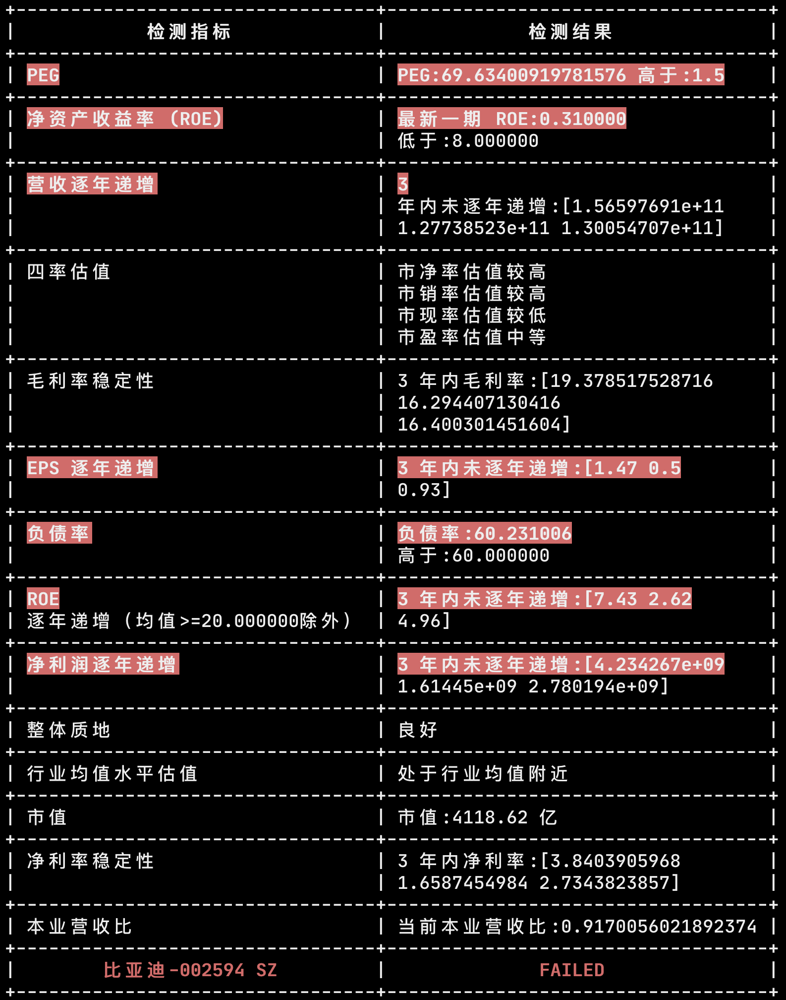

# x-stock

[](https://github.com/axiaoxin-com/x-stock/)
[](http://golang.org)
[](https://github.com/axiaoxin-com/x-stock)
[](https://gitHub.com/axiaoxin-com/x-stock/releases/)
[](https://gitHub.com/axiaoxin-com/x-stock/releases/)

使用 Golang 实现的个人股票工具，股票数据来源于东方财富网、亿牛网、腾讯证券。

该程序不构成任何投资建议，程序只是我个人辅助获取数据的工具，具体分析仍然需要自己判断。

## 功能

- 按指定条件的默认值自动筛选可以长期持有其股票的优质公司
- 按指定条件的自定义值自动筛选可以长期持有其股票的优质公司
- 实现股票检测器
- 支持 ROE、EPS、营收、利润、整体质地、估值、合理价、负债率、历史波动率、市值 检测
- 将筛选结果导出为 JSON 文件
- 将筛选结果导出为 CSV 文件
- 将筛选结果导出为 EXCEL 文件，并按行业、价格、历史波动率分工作表
- 将筛选结果导出为股票代码图片便于东方财富 APP 上导入到自选列表
- 支持关键词搜索股票并对其进行评估
- 检测器支持对银行股按不同规则进行检测
- 支持净利率和毛利率稳定性判断
- 增加获取东方财富智能诊股中综合评价和价值评估信息
- 支持 PEG 检测
- 支持营收本业比检测
- 支持财报审计意见检测
- 完善命令行使用方式，筛选参数和检测参数支持命令行自定义
- 支持负债流动比检测
- 支持现金流检测

TODO:

- 提供 WEB 界面操作
- 支持基金 4433 筛选
- 支持 ETF 筛选
- 支持港股检测
- 获取 K 线图数据
- 按我的 X 均线交易法则筛选可以买入的短期股票
- 检测器实现技术面检测方法
- 监控自选和持仓的股票，触发交易纪律则进行提醒
- 导入自选通过接口实现自动化
- 实现支持完整的东方财富选股器条件

## 我的选股规则

根据各种指标筛选值得长期持有其股票进行投资的优质公司。（优质公司不代表当前股价在涨，长线存股）

### 1. 财务优质

- 最新 ROE 高于 8%
- ROE 平均值小于 20 时，至少 3 年内逐年递增
- EPS 至少 3 年内逐年递增
- 营业总收入至少 3 年内逐年递增
- 净利润至少 3 年内逐年递增
- 负债率低于 60% （金融股除外）
- 配发股利
- 净利率、毛利率稳定（标准差不高于 1 ）
- 本业营收比 90%-110% 之间，经营内容具备基础、垄断、必要性服务等特征。`本业比=营业利润/(营业利润+营业外收入)`
- PEG 低于 1.5 `PEG=PE/净利润复合增长率` <0.8 低估成长动能，0.8-1.2 股价与成长动能匹配，1.2-1.5 市场给出较高评价，>1.5 股价与成长动能不匹配（个别股王除外）

### 2. 估值优质

- 估值较低或中等
- 股价低于合理价格（`合理价格 = 历史市盈率中位数 * (EPS * (1 + 今年 Q1 营收增长比))`）

### 3. 配置均衡

- 选择行业分散配置
- 历史波动率在 1 以内，进行持仓占比： 0.5 以下:0.5 以上 = 6:4

## 银行股选择标准

银行股由于盈利模式不同，因此选择标准略有不同。

1. ROE 高于 8%
2. ROA 高于 0.5%
3. 资本充足率高于 8%
4. 不良贷款率低于 3%
5. 不良贷款拨备覆盖率高于 100%

## 低价股选择标准

低价股定义：价格范围 10 - 30 元

1. 市净率不低于 1%
2. ROE 不低于 8%
3. 配发股利

## 使用方法

[点击下载对应系统最新版本解压得到可执行文件](https://github.com/axiaoxin-com/x-stock/releases/)

查看使用说明：

```
$ ./x-stock -h
NAME:
   x-stock - axiaoxin 的股票工具程序

USAGE:
   该程序不构成任何投资建议，程序只是个人辅助工具，具体分析仍然需要自己判断。

官网地址: http://x-stock.axiaoxin.com

VERSION:
   0.0.7

AUTHOR:
   axiaoxin <254606826@qq.com>

COMMANDS:
   exportor  股票筛选导出器
   checker   股票检测器
   help, h   Shows a list of commands or help for one command

GLOBAL OPTIONS:
   --loglevel value, -l value  日志级别 [debug|info|warn|error] (default: info) [$XSTOCK_LOGLEVEL]
   --help, -h                  show help (default: false)
   --version, -v               show the version (default: false)

COPYRIGHT:
   (c) 2021 axiaoxin
```

### exportor

exportor 是数据导出器，不使用参数默认导出 EXCEL 文件。

查看使用说明：

```
./x-stock exportor -h
NAME:
   x-stock exportor - 股票筛选导出器

USAGE:
   将按条件筛选出的股票导出到文件，根据文件后缀名自动判断导出类型。支持的后缀名：[xlsx|csv|json|png|all]，all 表示导出全部支持的类型。

OPTIONS:
   --filename value, -f value                      指定导出文件名 (default: ./dist/x-stock.20210509.xlsx) [$XSTOCK_EXPORTOR_FILENAME]
   --disable_check, -C                             关闭基本面检测，导出所有原始筛选结果 (default: false) [$XSTOCK_EXPORTOR_DISABLE_CHECK]
   --filter.min_roe value                          最低净资产收益率 (%) (default: 8.0)
   --filter.min_netprofit_yoy_ratio value          最低净利润增长率 (%) (default: 0.0)
   --filter.min_toi_yoy_ratio value                最低营收增长率 (%) (default: 0.0)
   --filter.min_zxgxl value                        最低最新股息率 (%) (default: 0.0)
   --filter.min_netprofit_growthrate_3_y value     最低净利润 3 年复合增长率（%） (default: 0.0)
   --filter.min_income_growthrate_3_y value        最低营收 3 年复合增长率（%） (default: 0.0)
   --filter.min_listing_yield_year value           最低上市以来年化收益率（%） (default: 0.0)
   --filter.min_pb_new_mrq value                   最低市净率 (default: 1.0)
   --filter.max_debt_asset_ratio value             最大资产负债率 (%) (default: 0.0)
   --filter.min_predict_netprofit_ratio value      最低预测净利润同比增长（%） (default: 0.0)
   --filter.min_predict_income_ratio value         最低预测营收同比增长（%） (default: 0.0)
   --filter.min_total_market_cap value             最低总市值（亿） (default: 100.0)
   --filter.industry_list value                    行业名
   --filter.min_price value                        股价范围最小值（元） (default: 0.0)
   --filter.max_price value                        股价范围最大值（元） (default: 0.0)
   --filter.listing_over_5_y                       上市时间是否超过 5 年 (default: false)
   --filter.min_listing_volatility_year value      最低上市以来年化波动率 (default: 0.0)
   --filter.exclude_cyb                            排除创业板 (default: true)
   --filter.exclude_kcb                            排除科创板 (default: true)
   --filter.special_security_name_abbr_list value  查询指定名称
   --filter.special_security_code_list value       查询指定代码
   --filter.min_roa value                          最小总资产收益率 ROA (default: 0.0)
   --checker.min_roe value                         最新一期 ROE 不低于该值 (default: 8.0)
   --checker.check_years value                     连续增长年数 (default: 3)
   --checker.no_check_years_roe value              ROE 高于该值时不做连续增长检查 (default: 20.0)
   --checker.max_debt_asset_ratio value            最大资产负债率百分比(%) (default: 60.0)
   --checker.min_hv value                          最大历史波动率 (default: 1.0)
   --checker.min_total_market_cap value            最小市值（亿） (default: 100.0)
   --checker.bank_min_roa value                    银行股最小 ROA (default: 0.5)
   --checker.bank_min_zbczl value                  银行股最小资本充足率 (default: 8.0)
   --checker.bank_max_bldkl value                  银行股最大不良贷款率 (default: 3.0)
   --checker.bank_min_bldkbbfgl value              银行股最低不良贷款拨备覆盖率 (default: 100.0)
   --checker.is_check_mll_stability                是否检测毛利率稳定性 (default: true)
   --checker.is_check_jll_stability                是否检测净利率稳定性 (default: true)
   --checker.is_check_price_by_calc                是否使用估算合理价进行检测，高于估算价将被过滤 (default: false)
   --checker.max_peg value                         最大 PEG (default: 1.5)
   --checker.min_byys_ratio value                  最小本业营收比 (default: 0.9)
   --checker.max_byys_ratio value                  最大本业营收比 (default: 1.1)
   --help, -h                                      show help (default: false)
```

命令行使用示例：

- 导出 JSON 文件：

```
./x-stock -l error exportor -f ./stocks.json
```

- 导出 CSV 文件：

```
./x-stock -l error exportor -f ./stocks.csv
```

- 导出 EXCEL 文件：

```
./x-stock -l error exportor -f ./stocks.xlsx
```

- 导出 PNG 图片：

```
./x-stock -l error exportor -f ./stocks.png
```

- 导出全部支持的类型：

```
./x-stock -l error exportor -f ./stocks.all
```

- 自定义筛选、检测参数

```
./x-stock -l error exportor -f ./stocks.xlsx --filter.min_roe=6 --checker.min_roe=6
```

### checker

给定关键词/股票代码搜索股票进行评估检测

查看使用说明：

```
./x-stock checker -h
NAME:
   x-stock checker - 股票检测器

USAGE:
   x-stock checker [command options] [arguments...]

OPTIONS:
   --keyword value, -k value             检给定股票名称或代码，多个股票批量检测使用/分割。如: 招商银行/中国平安/600519
   --checker.min_roe value               最新一期 ROE 不低于该值 (default: 8.0)
   --checker.check_years value           连续增长年数 (default: 3)
   --checker.no_check_years_roe value    ROE 高于该值时不做连续增长检查 (default: 20.0)
   --checker.max_debt_asset_ratio value  最大资产负债率百分比(%) (default: 60.0)
   --checker.min_hv value                最大历史波动率 (default: 1.0)
   --checker.min_total_market_cap value  最小市值（亿） (default: 100.0)
   --checker.bank_min_roa value          银行股最小 ROA (default: 0.5)
   --checker.bank_min_zbczl value        银行股最小资本充足率 (default: 8.0)
   --checker.bank_max_bldkl value        银行股最大不良贷款率 (default: 3.0)
   --checker.bank_min_bldkbbfgl value    银行股最低不良贷款拨备覆盖率 (default: 100.0)
   --checker.is_check_mll_stability      是否检测毛利率稳定性 (default: true)
   --checker.is_check_jll_stability      是否检测净利率稳定性 (default: true)
   --checker.is_check_price_by_calc      是否使用估算合理价进行检测，高于估算价将被过滤 (default: false)
   --checker.max_peg value               最大 PEG (default: 1.5)
   --checker.min_byys_ratio value        最小本业营收比 (default: 0.9)
   --checker.max_byys_ratio value        最大本业营收比 (default: 1.1)
   --help, -h                            show help (default: false)
```

命令行使用示例：

```
./x-stock -l error checker -k 比亚迪
```

检测结果：




## 欢迎 Star

[](https://githuv.com/axiaoxin-com/x-stock)
